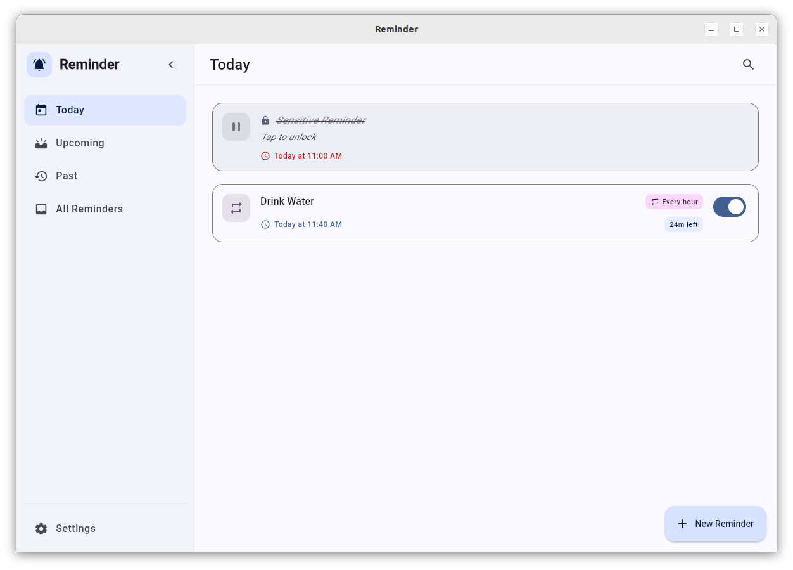
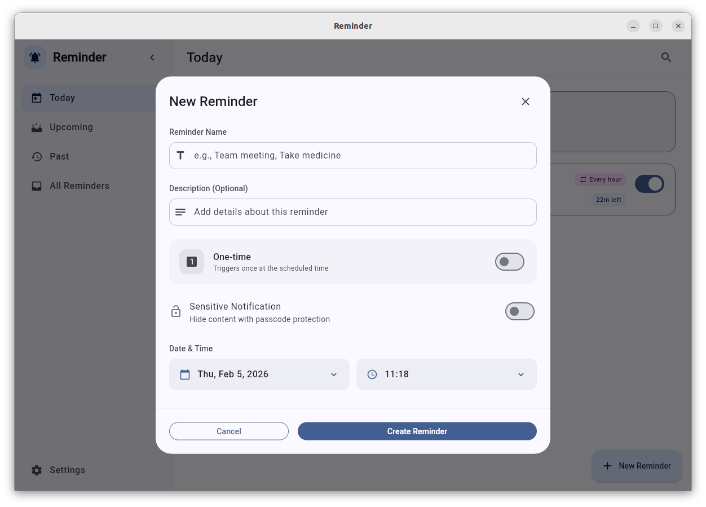
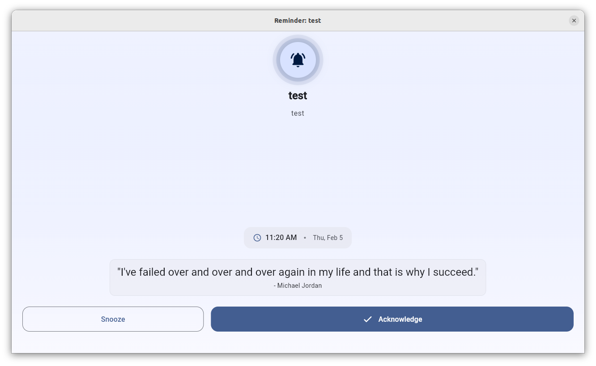
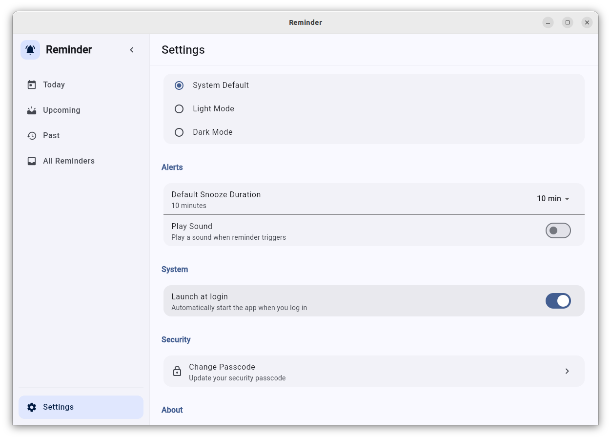

# Reminder App

A modern, Material 3 design reminder application built for Linux and Windows using Flutter. It features non-dismissible alert windows to ensure you never miss a task, and privacy features to keep your sensitive reminders secure.

## Screenshots

| Dashboard | New Reminder |
|:---:|:---:|
|  |  |
| **Manage your daily tasks** | **Create detailed reminders** |

| Alert Window | Settings |
|:---:|:---:|
|  |  |
| **Persistent non-dismissible alerts** | **Customize your experience** |

## Features

### 📅 Smart Reminders
- **Schedule Anywhere**: Create reminders with specific dates and times.
- **Persistent Alerts**: Reminder windows stay on top and cannot be easily dismissed until acknowledged or snoozed.
- **Snooze Options**: Flexible snooze durations (5min, 10min, 15min, 30min).

### 🔒 Privacy & Security
- **Sensitive Reminders**: Mark specific reminders as "Sensitive".
- **Obfuscated View**: Sensitive content is hidden from the main list and alert windows by default.
- **Passcode Protection**: Set a 4-digit passcode to view sensitive content.
- **Secure Handling**: Alert windows for sensitive reminders hide descriptions until unlocked.

### ⚙️ Customization
- **Theme Support**: Choose between System, Light, and Dark modes.
- **Sound Alerts**: Toggle notification sounds on or off.
- **System Integration**: Option to launch the app automatically at system startup (login).

### 🛠️ Developer Friendly
- **Local Database**: Built with `Drift` for robust SQLite local storage.
- **State Management**: Powered by `Riverpod`.
- **Desktop Native**: Utilizes `window_manager` and `desktop_multi_window` for a native desktop feel.

## Getting Started

### Prerequisites
- [Flutter SDK](https://docs.flutter.dev/get-started/install) (3.10.8 or higher)
- Linux or Windows environment
- `SQLite` libraries (usually included, but may need `libsqlite3-dev` on Linux)

### Installation

1. **Clone the repository**
   ```bash
   git clone https://github.com/hareendranmg/reminder.git
   cd reminder
   ```

2. **Install Dependencies**
   ```bash
   flutter pub get
   ```

3. **Run the Application**
   ```bash
   flutter run -d linux  # or windows
   ```

## Packaging

To package the application for Linux (Debian) using `fastforge`, run:

```bash
fastforge package --platform linux --targets deb
```

## Usage

### Managing Passcodes
- Go to **Settings** > **Security** to set up a passcode.
- There is a defualt passcode if you forgot yours. Please refer the code to find it.
- You can change your passcode at any time (requires existing passcode).

### Creating Sensitive Reminders
1. Click the **+** (Add) button.
2. Fill in the title and description.
3. Toggle the **Sensitive** switch.
4. Set the date and time.
5. Save. The reminder will appear with localized/hidden text in the list.

## Tech Stack
- **Framework**: Flutter
- **Language**: Dart
- **Database**: Drift (SQLite)
- **State Management**: Riverpod
- **Window Management**: desktop_multi_window, window_manager, tray_manager
- **UI**: Flutter Animate, Animations
